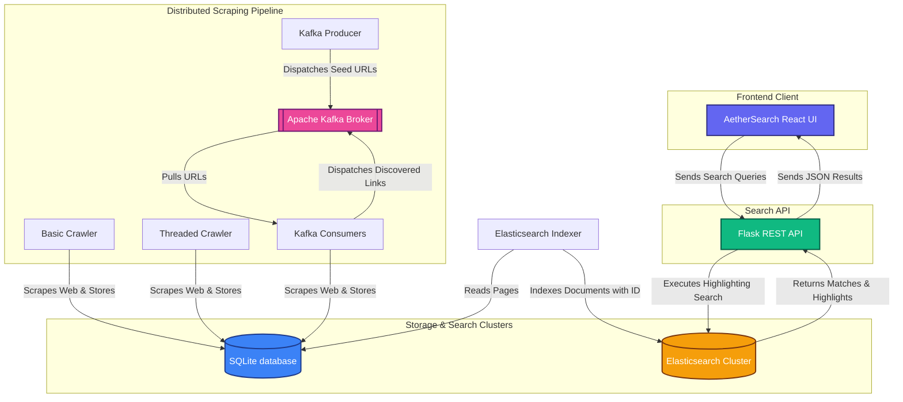

# AetherSearch: Distributed Web Crawler & Search Engine

AetherSearch is a highly scalable, distributed web crawling and search engine system designed to scrape, index, and retrieve web document data with high performance. Built with a robust Python scraping pipeline, SQLite backend, Apache Kafka distributed messaging, Elasticsearch search cluster, a Flask REST API, and a beautiful React dashboard, this project represents an end-to-end distributed system for modern search applications.

## Key Features

* **Multi-Threaded Crawler**: High-throughput crawler that employs a thread-safe connection pooling model with an active worker scheduler, ensuring no early termination while preserving site etiquette through rate limiting.
* **Distributed Crawler (Kafka)**: A scale-out crawling pipeline where URLs are dispatched and distributed across multiple worker processes utilizing Apache Kafka topics.
* **SQLite Storage Layer**: Clean relational schema optimized with unique indexing to prevent duplicates and secure transaction control.
* **Elasticsearch Engine**: High-performance full-text search indexing, utilizing unique page identifiers to update records seamlessly and prevent search space pollution.
* **High-Performance Flask API**: Clean search endpoint implementing Elasticsearch multi-match queries with customized highlighting snippet extractors, paginated result sets, and a prefix-phrase autocomplete suggestion endpoint.
* **Search Autocomplete**: Real-time type-ahead suggestions powered by Elasticsearch `match_phrase_prefix` queries, with a debounced dropdown that supports keyboard navigation.
* **Paginated Search Results**: Server-side pagination splitting result sets into pages of 10 items, with Google-style page navigation controls and total result counts.
* **Docker Compose Deployment**: Single-command multi-container orchestration packaging Elasticsearch, the Flask API, and the React frontend into a portable, reproducible stack.
* **AetherSearch React Client**: Premium, glassmorphic search dashboard built with React and Vite, featuring smooth transition micro-animations, real-time search timing metrics, XSS-safe highlight rendering, and API health telemetry.

---

## System Architecture

The following diagram illustrates the flow of URLs, scraped web documents, indexing pipeline, and query retrieval path across all components of AetherSearch:



---

## Project Directory Structure

```text
Distributed-Web-Crawler/
├── .gitignore                               # Root git exclusion list
├── README.md                                # Root documentation
├── docker-compose.yml                       # Multi-container Docker orchestration
├── render.yaml                              # Render cloud infrastructure blueprint
└── Distributed-Web-Crawler/
    ├── .dockerignore                        # Docker build exclusion list
    ├── requirements.txt                     # Backend python dependencies
    ├── backend/
    │   ├── Dockerfile                       # Backend container image
    │   ├── start.sh                         # Container startup shell script
    │   ├── api/
    │   │   └── app.py                       # Flask Search API (search, autocomplete)
    │   ├── crawler/
    │   │   ├── basic_crawler.py             # Single-threaded relational crawler
    │   │   ├── threaded_crawler.py          # Multi-threaded relational crawler
    │   │   └── url_manager.py               # Absolute URL resolver & normalizer
    │   ├── database/
    │   │   ├── database.py                  # Database schema initializer & migrations
    │   │   ├── view_db.py                   # Data inspection tool
    │   │   └── crawler.db                   # SQLite database file (ignored)
    │   ├── indexer/
    │   │   └── elasticsearch_indexer.py     # Bulk SQLite to Elasticsearch document indexer
    │   ├── scripts/
    │   │   └── render_bootstrap.py          # Render bootstrap crawler data seeder & indexer
    │   └── kafka/
    │       ├── producer.py                  # Seed URL dispatcher
    │       └── consumer.py                  # Distributed crawler consumer worker
    └── frontend/                            # AetherSearch UI (React & Vite)
        ├── .dockerignore                    # Frontend docker build exclusion list
        ├── .gitignore                       # Frontend local git exclusion list
        ├── Dockerfile                       # Frontend container image
        ├── README.md                        # Frontend documentation
        ├── eslint.config.js                 # ESLint linter config
        ├── index.html                       # HTML head metadata & titles
        ├── package.json                     # Node/NPM dependencies
        ├── package-lock.json                # NPM dependency lockfile
        ├── vite.config.js                   # Vite bundler configuration
        ├── public/                          # Public assets folder
        └── src/
            ├── App.jsx                      # Main search UI layout entrypoint
            ├── App.css                      # Premium glassmorphic stylesheet
            ├── index.css                    # Global browser resets
            ├── main.jsx                     # Vite React entrypoint
            ├── components/                  # Extracted modular React components
            │   ├── Favicon.jsx              # Domain favicon logic with image fallbacks
            │   ├── Header.jsx               # Header logo, home button, API status
            │   ├── SearchBar.jsx            # Autocomplete input & key listener handler
            │   ├── SuggestedQueries.jsx     # Suggested search click triggers
            │   ├── SearchResults.jsx        # Search tabs (All, Pages, Books, Domains) & items
            │   ├── Pagination.jsx           # Google-style page navigation
            │   └── SkeletonLoading.jsx      # Placeholder loading templates
            └── hooks/                       # Custom React hooks
                └── useSearchState.js        # Centralized state, debounce & API fetching hook
```

---

## System Requirements

Ensure the following environments are installed and configured on your host machine:

### Local Development

* **Operating System**: Windows / Linux / macOS (tested on Windows 11)
* **Python**: v3.10 or higher
* **Node.js**: v18.0 or higher (NPM v9.0+)
* **Java SDK**: v11 or higher (required for Apache Kafka and Elasticsearch running locally)
* **Elasticsearch**: v8.x or higher
* **Apache Kafka**: v3.x or higher (including ZooKeeper)

### Docker Deployment

* **Docker Engine**: v20.10 or higher
* **Docker Compose**: v2.0 or higher

---

## Installation and Setup

### 1. Database Initialization
Before running the crawlers, run the database setup script to generate the schema with proper constraints:
```bash
cd Distributed-Web-Crawler/backend/database
python database.py
```

### 2. Running the Crawlers
You can populate the database using either the single-threaded relational crawler or the high-throughput multi-threaded crawler.

* **Option A: Basic Crawler**
  ```bash
  cd ../crawler
  python basic_crawler.py
  ```
  This will crawl up to 10 pages under the default domain `https://example.com` and store the HTML content in the SQLite database.

* **Option B: Threaded Crawler**
  ```bash
  cd ../crawler
  python threaded_crawler.py
  ```
  This uses 5 concurrent workers to scrape `https://books.toscrape.com` with robust scheduling, keeping active connections open safely without early termination.

### 3. Distributed Crawling with Apache Kafka
To run the crawler in a distributed scale-out architecture:

1. **Start ZooKeeper** (run from your Kafka installation directory):
   ```bash
   .\bin\windows\zookeeper-server-start.bat .\config\zookeeper.properties
   ```
2. **Start Kafka Broker**:
   ```bash
   .\bin\windows\kafka-server-start.bat .\config\server.properties
   ```
3. **Run Kafka Consumer** (launches the distributed crawler node):
   ```bash
   cd Distributed-Web-Crawler/backend/kafka
   python consumer.py
   ```
4. **Run Kafka Producer** (dispatches seed URL to start crawling):
   ```bash
   python producer.py
   ```

### 4. Elasticsearch Indexing
To load your scraped pages from SQLite into Elasticsearch for full-text search capability:

1. **Start Elasticsearch** (run from your Elasticsearch installation directory):
   ```bash
   .\bin\elasticsearch.bat
   ```
2. **Execute Indexer**:
   ```bash
   cd Distributed-Web-Crawler/backend/indexer
   python elasticsearch_indexer.py
   ```
   This reads SQLite records, maps them into search-ready schemas, and updates index documents on Elasticsearch at `http://localhost:9200`.

### 5. Running the Flask Search API
Boot the backend REST API which acts as the intermediary between the frontend interface and the Elasticsearch index:
```bash
cd Distributed-Web-Crawler/backend/api
python app.py
```
The server will start running on `http://127.0.0.1:5000`.

### 6. Starting the AetherSearch React Interface
Launch the modern, premium glassmorphic dashboard to search your indexed web databases:

1. Navigate to the frontend directory:
    ```bash
    cd Distributed-Web-Crawler/frontend
    ```
2. Install dependencies:
    ```bash
    npm install
    ```
3. Start the Vite development server:
    ```bash
    npm run dev
    ```
4. Open your browser and navigate to `http://localhost:5173`.

### Alternative: Docker Compose Quick-Start

If you have Docker installed, you can spin up the entire stack (Elasticsearch, Flask API, React UI) with a single command from the project root:

```bash
docker compose up --build -d
```

This will:
* Start Elasticsearch on `http://localhost:9200`
* Start the Flask API on `http://localhost:5000`
* Serve the React frontend on `http://localhost:5173`

To stop the stack:
```bash
docker compose down
```

To remove all persisted Elasticsearch data:
```bash
docker compose down -v
```

## Technical Features Implemented

### Bulletproof Scraping Robustness
We resolved and optimized critical connection lifetime and execution bottlenecks in the crawler engine:
* **SQLite Scope Safeties**: Fixed database transaction lifetimes where connections were closed prematurely inside crawling loop cycles.
* **Thread-Safe Schedulers**: Engineered an active worker state tracker using cross-thread locks, resolving standard queue starvation where threads died prematurely because the crawler queue was temporarily empty while other workers fetched pages.
* **Index Integrity**: Modified Elasticsearch document mappings to force `id=url` indexing keys, guaranteeing no duplicate document entries when the indexer is executed multiple times.

### Premium Search UI Experience
We built a state-of-the-art glassmorphic dark theme dashboard:
* **API Telemetry**: Visual indicators displaying search execution time (in milliseconds) and result quantity dynamically.
* **Functional Search Categorization**: Tabbed search routing that dynamically partitions matches into **All** (complete list), **Pages** (general information documents like Wikipedia, news, and tools), and **Books** (book catalog items from `books.toscrape.com`), matching industry-standard search filter patterns.
* **Domain Footprint Aggregation**: A high-fidelity **Domains** tab grouping all search hits by their root hostnames. Each matching domain is presented in a card showing favicon telemetry, aggregate match counts, and a nested tree hierarchy of matching pages with individual previews.
* **Dynamic Loading States**: Responsive loading skeletons that fade in and out to provide a highly polished, responsive interface.
* **Content Contextualization**: Integration of Elasticsearch search term highlighting with robust, XSS-safe rendering using safe client sanitization.
* **Strict Parameter Controls**: Enhanced URL validation and empty query blocking on client inputs, with matching HTTP status codes (HTTP 400 Bad Request) on the Flask endpoint.

### Search Autocomplete
* **Prefix-Phrase Matching**: Uses Elasticsearch `match_phrase_prefix` on the `title` field against the existing index, requiring zero re-indexing.
* **Debounced Suggestions**: Frontend debounces input by 250ms to minimize API calls while maintaining a responsive feel.
* **Keyboard Navigation**: Full arrow-key and Enter/Escape keyboard support for the suggestion dropdown.

### Paginated Results
* **Server-Side Pagination**: The `/search` endpoint accepts `page` and `size` parameters, returning a structured response with `results`, `total`, `page`, and `size` fields.
* **Google-Style Page Controls**: Previous/Next navigation with numbered page buttons, ellipsis for large result sets, and smooth scroll-to-top on page change.

### Containerized Deployment
* **Docker Compose Orchestration**: Three-service stack (Elasticsearch, Flask API, React frontend) with health-check-gated startup ordering and persistent volume for Elasticsearch data.
* **Build-Arg Configuration**: The frontend Dockerfile accepts `VITE_API_URL` as a build argument, baked into the static bundle at build time.

---

## Environment Variables

| Variable | Component | Default | Description |
|---|---|---|---|
| `ES_HOST` | Backend | `http://localhost:9200` | Elasticsearch connection URL |
| `VITE_API_URL` | Frontend | `http://127.0.0.1:5000` | Flask API base URL (build-time) |